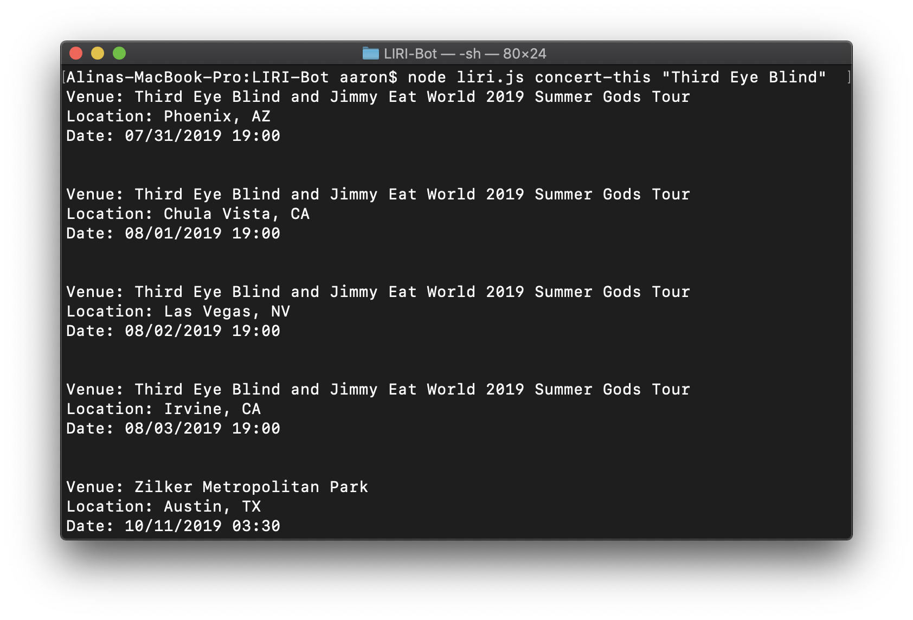
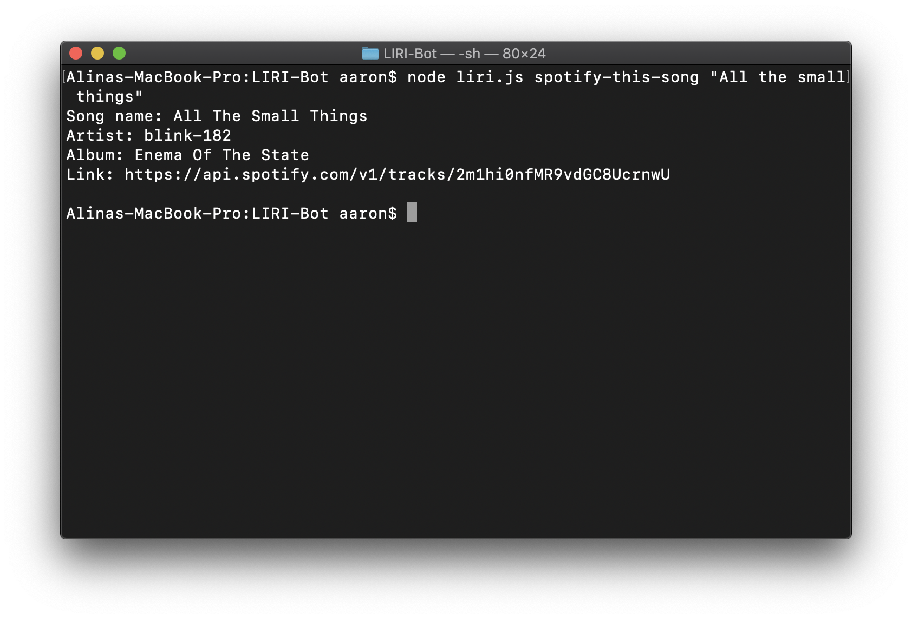
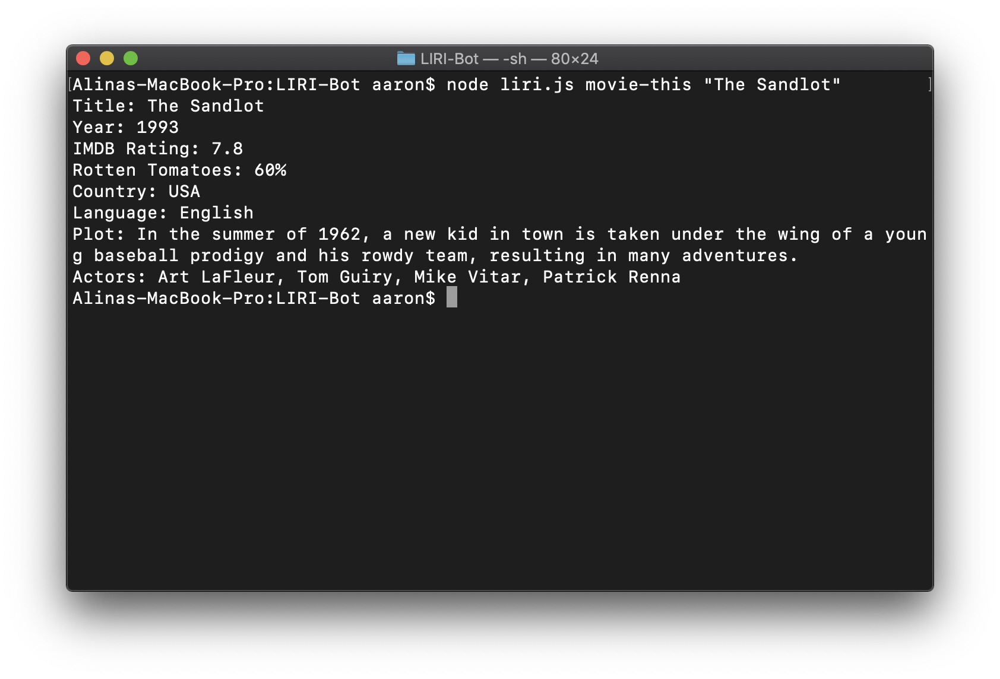
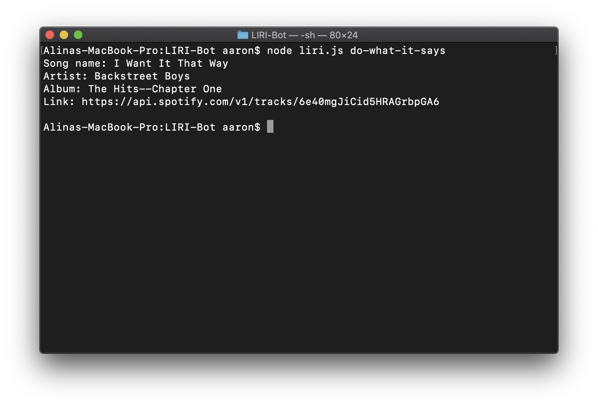

# LIRI-Bot
A CLI application to obtain information from Spotify API and OMDB API

# Modes of use

1. concert-this
Run the following command in the terminal:
``` 
node liri.js concert-this "name of the artist/band"
```

2. spotify-this-song
Run the following command in the terminal:
``` 
node liri.js spotify-this-song "name of the song"
```

3. movie-this
Run the following command in the terminal:
``` 
node liri.js movie-this "name of the movie"
```

4. do-what-it-says
Run the following command in the terminal:
``` 
node liri.js do-what-it-says
```

# How to run LIRI-Bot
1. Install all the node modules
Run the following command in the terminal:
``` 
npm install
```

2. Run the LIRI-Bot (refer to Modes of use)

# Screenshots of the LIRI-Bot

1. concert-this

2. spotify-this-song

3. movie-this

4. do-what-it-says
